# Prompt CRM — The AI-First CRM Where You Just Describe What You Want

> **Stop clicking through forms. Start typing what you mean.**
>
> Prompt CRM is a multi-tenant CRM, where *every* meaningful action — defining your data model, importing contacts, building audiences, sending email & WhatsApp campaigns, planning events, setting reminders — is driven by a natural-language prompt. The AI proposes, the human reviews, the system executes.

---

## Table of Contents

1. [What Is Prompt CRM?](#what-is-prompt-crm)
2. [Why Prompt-First?](#why-prompt-first)
3. [The End-to-End Story](#the-end-to-end-story)
4. [Feature Tour](#feature-tour)
5. [How the AI Actually Works](#how-the-ai-actually-works)
6. [Tech Stack](#tech-stack)
7. [Architecture](#architecture)
8. [Repository Layout](#repository-layout)
9. [Getting Started](#getting-started)
10. [Configuration & Environment Variables](#configuration--environment-variables)
11. [API Reference](#api-reference)
12. [Data Model](#data-model)
13. [Roles & Permissions](#roles--permissions)

---

## What Is Prompt CRM?

Prompt CRM is a **multi-tenant, AI-first CRM platform** built for organizations that manage large networks of people — customers, leads, alumni, members, partners, donors, applicants, anyone.

Unlike traditional CRMs where you spend hours configuring fields, building filter UIs, drafting emails, and selecting recipients one by one, Prompt CRM lets you do all of that with sentences:

| You type… | The system does… |
|---|---|
| *"Track first name, last name, email, phone, college, graduation year, current company, and city for each contact."* | Generates a typed schema, asks you to approve, and saves it. |
| *"Import this CSV"* (with mismatched headers like `EMail Address`, `Mobile #`, `Grad Yr`) | Uses an LLM to map every column to the right CRM field, asks you to approve, and bulk-imports the rows. |
| *"All alumni from IIT Delhi who graduated after 2018 and now work in product."* | Builds a query plan combining structured filters and semantic search, returns a pre-selected list, lets you save it as a reusable Segment. |
| *"Invite the Bangalore alumni segment to a product launch on May 24th in Indiranagar."* | Drafts the event name + description, pre-selects the right segments and individuals, lets you review, and creates the event. |
| *"Send a friendly reminder to everyone we invited but who hasn't RSVP'd yet."* | Pre-selects the right contacts, drafts subject + body with personalization tokens, validates merge placeholders, and sends through Brevo. |
| *"Remind me to follow up with the Mumbai meetup attendees next Friday."* | Generates a reminder draft (title, description, due date), assigns to you, and saves it. |

The internal team uses the platform; **external contacts never log in** — they only receive Email and WhatsApp.

---

## Why Prompt-First?

Traditional CRMs make the human translate intent into clicks. Prompt CRM inverts that:

1. **The AI proposes.** Every prompt produces a *draft* — a query plan, a contact list, a message, a schema diff, a reminder — never a silent commit.
2. **The human reviews.** You see exactly which contacts will be touched, what the email will say, what fields will be created. Edit anything.
3. **The system executes.** Only after explicit approval does anything get saved or sent.

This *propose → review → execute* loop is the heart of the product. It keeps users in control while eliminating 90% of the manual configuration work that makes traditional CRMs miserable.

---

## The End-to-End Story

A new admin's first hour with Prompt CRM looks like this:

```
1. Sign in with Google
        │
        ▼
2. /schema-setup
   "Track every contact's name, email, phone, college, graduation
    year, current company, role, city, and skills."
        │
        ▼  (LLM proposes 9 typed fields → admin approves)
3. /contacts/import
   Drag in alumni_export_2024.csv
        │
        ▼  (LLM matches columns → admin approves → 3,420 rows imported,
              text fields auto-embedded for semantic search)
4. /segments
   "Alumni who studied CS and now work at FAANG companies."
        │
        ▼  (Semantic + structured query plan → 187 contacts pre-selected
              → admin trims list → saves as 'CS-FAANG' segment)
5. /events
   "Networking dinner for the CS-FAANG segment on June 12th in SF."
        │
        ▼  (Draft event name + description generated → segment auto-attached
              → admin approves → event saved)
6. /communications
   "Send the invite to everyone in the CS-FAANG segment."
        │
        ▼  (Subject + body drafted with {{first_name}}, {{event_name}}
              merge tags → preview shown → admin approves → Brevo sends
              personalized emails to each recipient)
7. /reminders
   "Remind me to follow up with non-RSVPs three days before the event."
        │
        ▼  (Reminder created with title, description, and due date)
8. /analytics
   See open rates, click rates, RSVP funnel, and growth metrics.
```

No filter UIs. No template editors. No mail-merge tutorials. Just sentences.

---

## Feature Tour

### 1. Dynamic Schema Setup (Prompt-Driven)

<p align="center">
  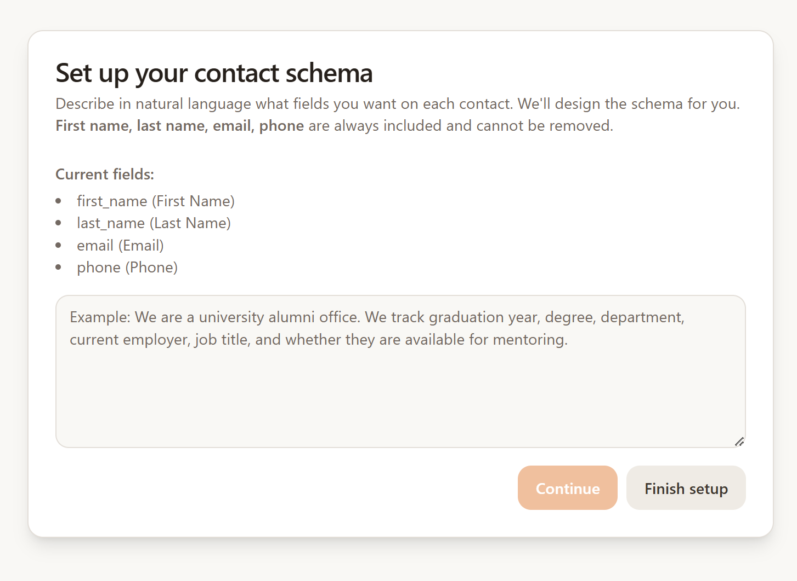
  <br/>
  <em>Screenshot — the <code>/schema-setup</code> page after entering a prompt and seeing the LLM-proposed field list.</em>
</p>

Each organization defines its own contact schema *in English*. The LLM converts that prompt into a typed list of fields (`text`, `number`, `date`, `boolean`), each optionally flagged for vector embedding so it becomes semantically searchable.

- **`POST /schema/build`** — Prompt → suggested fields (review-then-save)
- **`POST /schema/fields/bulk`** — Persist the approved field set
- **`POST /schema/edit`** — Multi-action edits in one prompt (*"Remove `fax`, add `linkedin_url`, rename `dept` to `department`"*)
- **`POST /schema/complete-setup`** — Mark org as ready to use the rest of the app

### 2. Smart CSV / Excel Import (Two-Step, AI-Mapped)

<p align="center">
  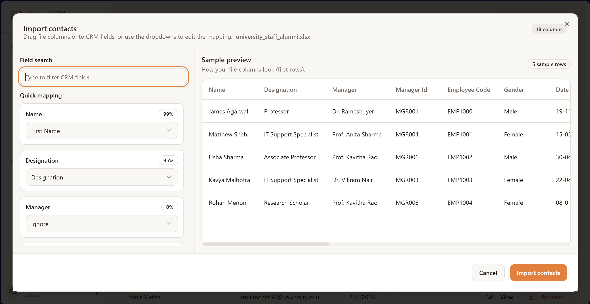
  <br/>
  <em>Screenshot — the import dialog showing LLM-suggested column → field mappings with confidence and unmapped columns.</em>
</p>

You don't have to rename your columns. Drop in any CSV/Excel and the importer:

1. **`POST /imports/upload`** — Reads the file, samples rows, asks the LLM to match each file column to a CRM field (or mark as unmapped). Returns a mapping suggestion plus per-column confidence and warnings.
2. **`POST /imports/approve`** — User reviews, tweaks, and approves the mapping. Backend then imports every row, splits `full_name` if needed, upserts custom attributes, and **automatically generates 384-dim embeddings** for any text field flagged `needs_embedding`.

The LLM also rejects files that obviously aren't contact data ("This appears to be a sales-pipeline export, not contacts").

### 3. Contacts

<p align="center">
  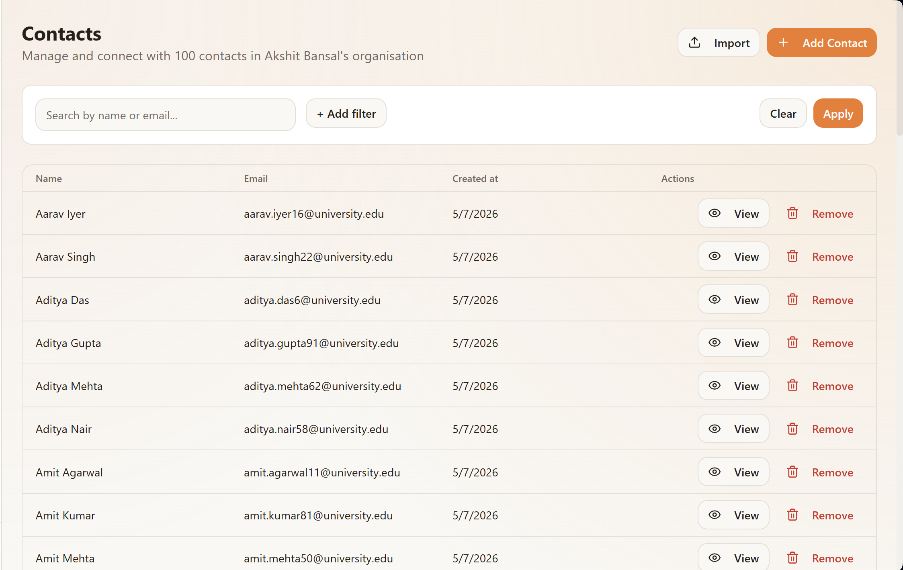
  <br/>
  <em>Screenshot — the <code>/contacts</code> page with the table, filters panel, and a contact detail drawer open.</em>
</p>

Standard CRUD plus a powerful **filter API** that combines structured filters across both core fields (`first_name`, `last_name`, `email`, `phone`) and any custom attribute defined for the org.

- **`POST /contacts/search`** — Mix `eq`, `contains`, `gt/lt/gte/lte`, `between` across any field
- **`POST /contacts/prompt`** — Run natural-language operations against contacts (validated against the contacts context to prevent prompt drift)

### 4. Audience Segments (Semantic + Structured)

<p align="center">
  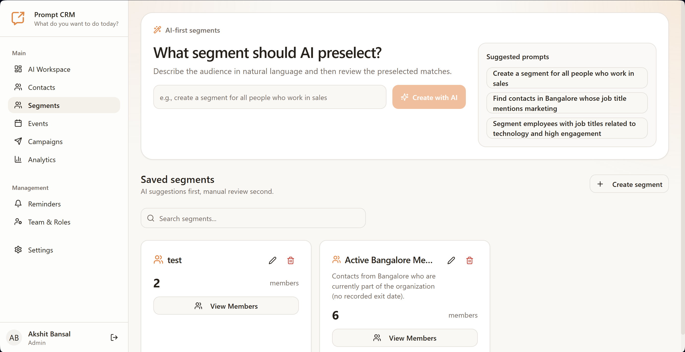
  &nbsp;&nbsp;
  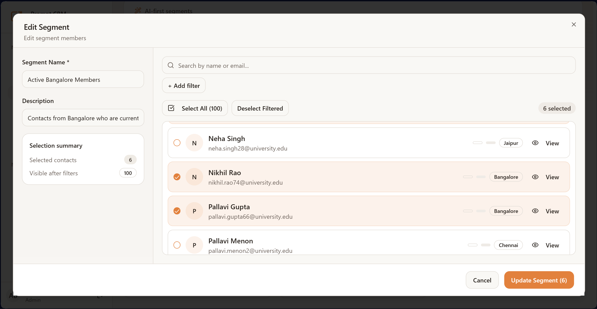
  <br/>
  <em>Screenshots — left: the prompt input on <code>/segments</code>; right: the LLM-proposed audience preview before saving.</em>
</p>

Segments are **reusable, prompt-built audience definitions**.

```
POST /segments/preview
→ "Engineers in Bangalore who attended at least one event last year"
```

The backend:
1. Validates the prompt is actually about audience selection.
2. Runs `build_contact_query_plan(prompt, schema)` — the LLM produces a structured plan with `semantic_filters` (e.g. `{"field": "job_title", "query": "engineer", "threshold": 0.55}`) and `exact_filters` (e.g. `{"field": "city", "op": "eq", "value": "Bangalore"}`) plus `AND/OR` logic.
3. Executes the plan via the **query engine** (`core/query_engine.py`):
   - Each semantic filter runs a cosine-similarity search over the field's embeddings.
   - The intersected/unioned candidate IDs are passed to `run_contact_filter_query()` for the structured pass.
4. Returns the matched contacts plus a **suggested name + description** for the segment.

The user reviews the matches, edits the list, names the segment, and `POST /segments/` persists it. The segment's name + description + prompt are then **embedded** so future prompts can resolve segment names semantically (*"send to the SF folks"* → matches the *"San Francisco alumni"* segment).

### 5. Events

<p align="center">
  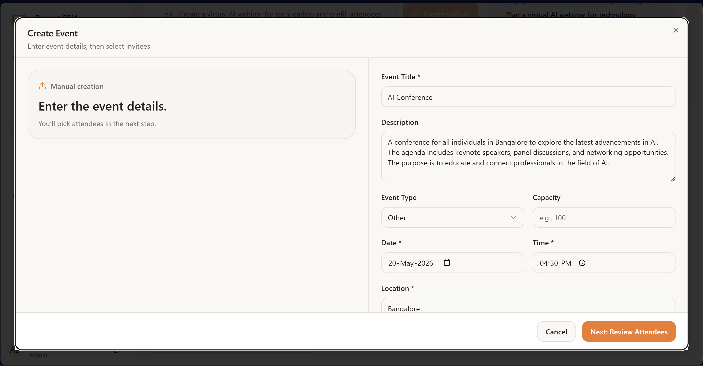
  <br/>
  <em>Screenshot — the Create Event dialog showing AI-drafted name + description and the auto-selected invite list.</em>
</p>

Events follow the same propose-then-approve pattern.

- **`POST /events/preview`** — Drafts the event (`compose_event_draft`) and pre-selects invitees by combining a semantic search over **existing segments and events** with a fresh contact query plan.
- **`POST /events/`** — Creates the event with the approved invite list, embeds the event for future semantic resolution.
- **`PATCH /events/{id}/rsvp`** — Track RSVPs (`invited` / `attending` / `declined` / `maybe`).
- **`PATCH /events/{id}/invite-sent`** — Track per-channel send state.

### 6. Communications & Campaigns (Email + WhatsApp)

<p align="center">
  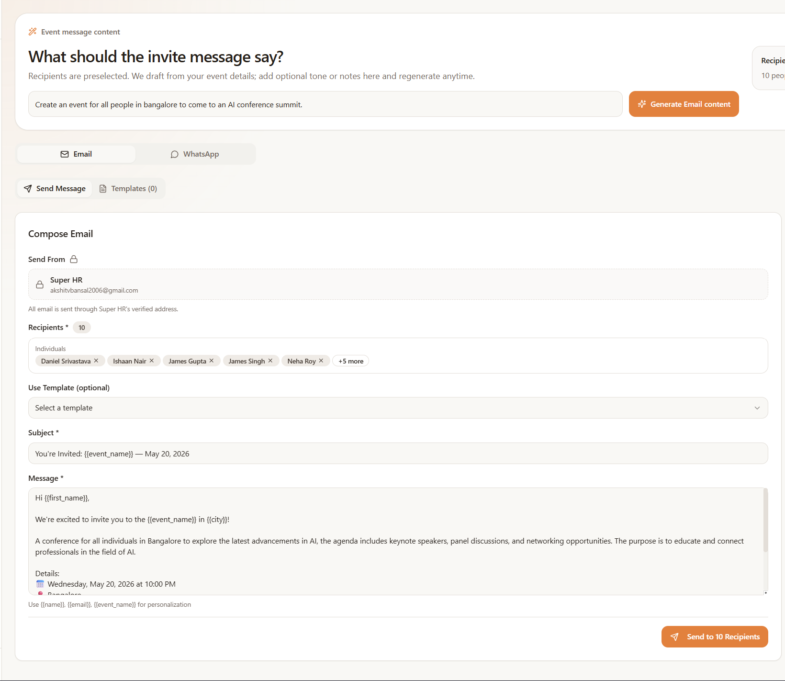
  <br/>
  <em>Screenshot — the campaign builder showing the prompt, AI-generated subject + body with merge tags, and the recipient preview list.</em>
</p>

The campaigns module is the most powerful AI surface in the app.

- **`POST /campaigns/preview`** — Prompt → query plan → pre-selected audience. *Also* runs a semantic search over **existing segments and events** so prompts like *"send to the launch event invitees"* automatically pull in the right segment/event context.
- **`POST /campaigns/compose`** — Generates the **subject + body** for the chosen channel (email or WhatsApp). For email, it tells the LLM exactly which merge placeholders are valid (built from the org's schema + extras like `{{event_name}}`).
- **`POST /campaigns/validate-merge-template`** — Validates `{{...}}` placeholders before send and returns hints for any unknown tokens.
- **`POST /campaigns/`** — Creates the campaign. If `send_via_brevo: true` and channel is `email`:
  1. Pulls every recipient's full attribute set.
  2. Builds a merge context per row (canonicalizing `firstName` → `first_name`, etc.).
  3. Merges subject + body, converts to HTML, and ships through **Brevo's transactional API**.
  4. Records per-contact success / failure / skipped.

Sender, reply-to, and per-recipient personalization are all wired in. Campaigns can also be saved as drafts and updated/scheduled later.

### 7. Templates

<p align="center">
  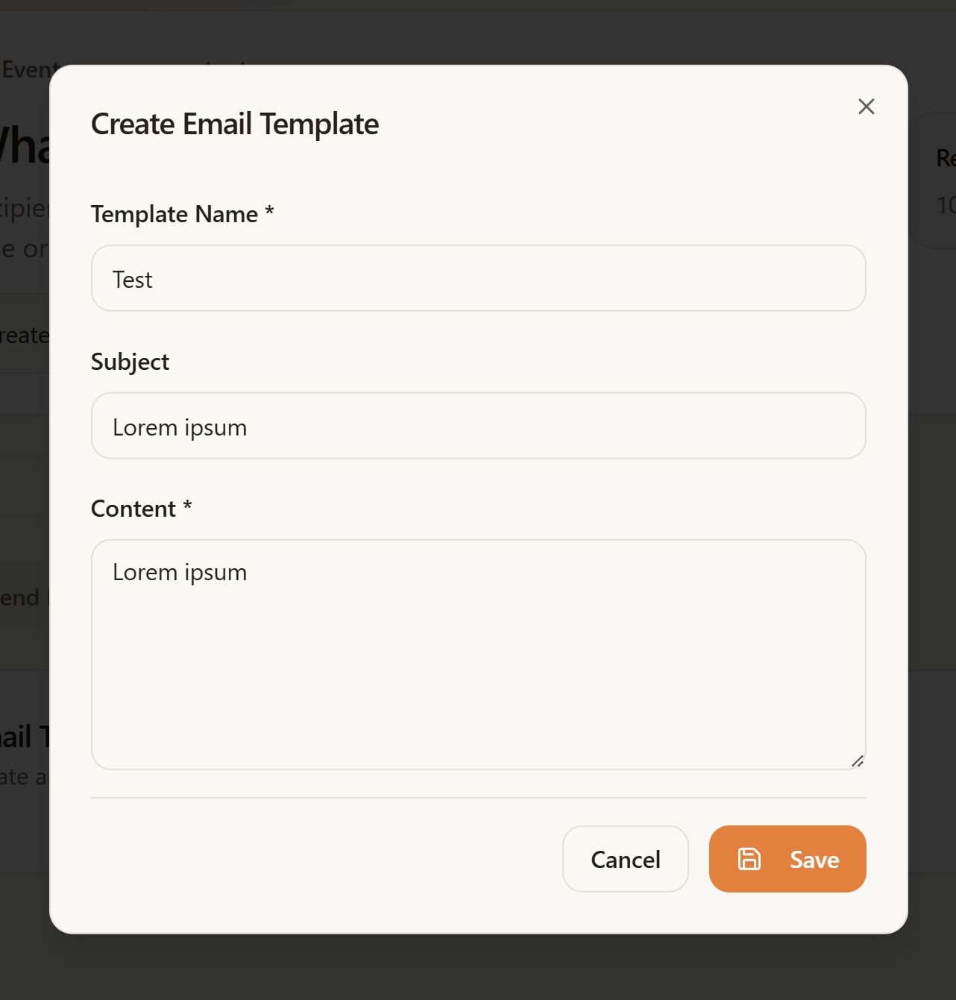
  <br/>
  <em>Screenshot — the template editor with merge-tag hints visible.</em>
</p>

Reusable email & WhatsApp templates with **strict merge-placeholder validation**. You can't save a template that references a field your org doesn't have — the API returns clear hints listing every valid token.

### 8. Reminders (AI-Drafted)

<p align="center">
  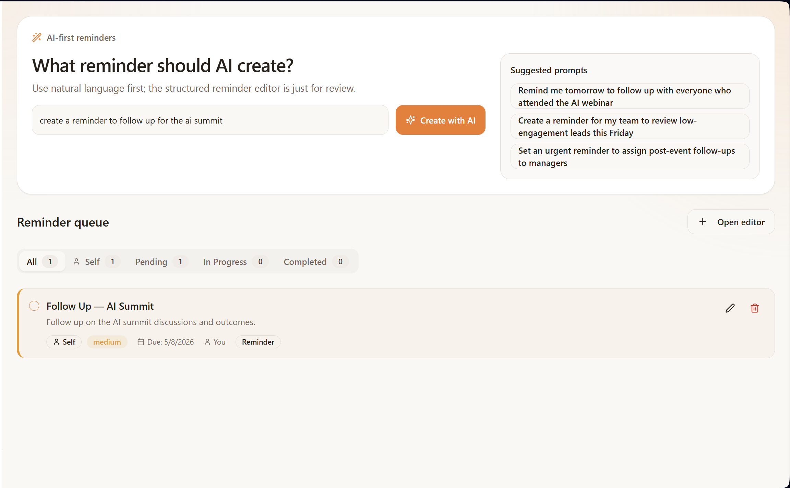
  <br/>
  <em>Screenshot — the Reminders page with the AI-drafted reminder preview before saving.</em>
</p>

- **`POST /reminders/preview`** — *"Remind me next Tuesday at 10am to check on the Q2 outreach numbers"* → drafts a title, description, and due date.
- **`POST /reminders/`** — Self-assign or assign to a teammate (validated to be in the same org).
- Standard list / patch / delete.

### 9. Analytics

<p align="center">
  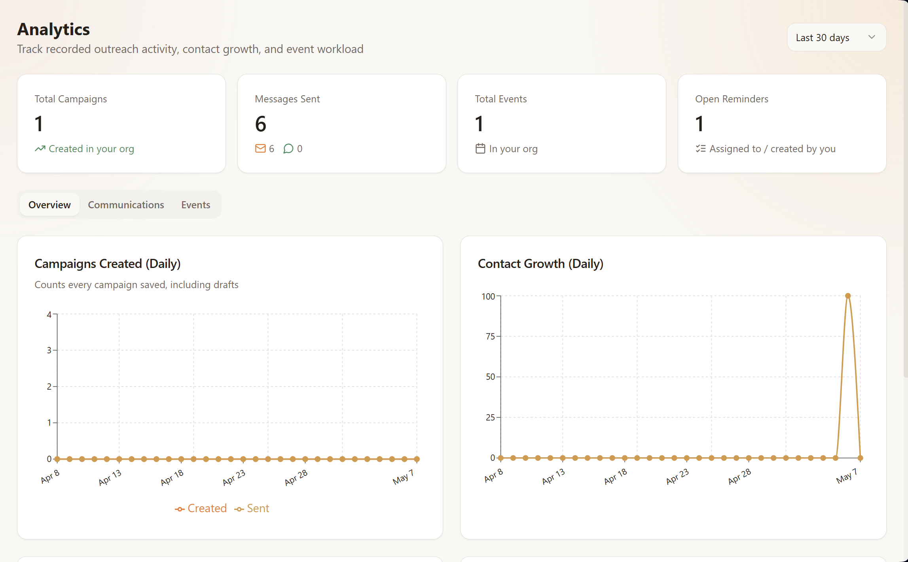
  <br/>
  <em>Screenshot — the Analytics page with overview cards and at least one time-series chart.</em>
</p>

- **`GET /analytics/overview`** — Org-level snapshot (contacts, campaigns, events, opens, clicks, etc.) scoped to the user.
- **`GET /analytics/timeseries`** — Time-bucketed series for any of:
  `contacts_created`, `campaigns_created`, `campaigns_sent`, `events_created`, `reminders_created`, `messages_sent`, `emails_sent`, `whatsapp_sent`, `messages_opened`, `messages_clicked` — bucketed by `day`, `week`, or `month`, over up to 365 days.

### 10. Users, Roles & Multi-Tenancy

<p align="center">
  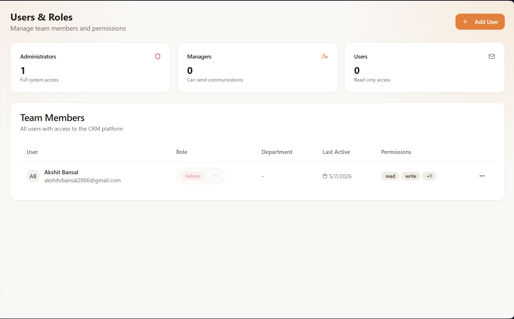
  <br/>
  <em>Screenshot — the Users &amp; Roles admin page showing the team list, role badges, and the invite dialog.</em>
</p>

Every row is org-scoped. Three roles:

- **admin** — Full access, schema management, user invites, role changes, deactivation.
- **manager** — All non-admin operations.
- **user** — Same as manager today; reserved for finer-grained restrictions.

The first user to sign in **bootstraps the first organization** and becomes its admin. After that, admins invite teammates by email + role (`POST /auth/invite`), and the invitee creates their account on first Google login.

---

## How the AI Actually Works

Prompt CRM uses **two complementary AI primitives**:

### 1. Groq-hosted Llama 3.3 70B (via `core/llm.py`)

Every AI feature funnels through `core/llm.py`, which:

- Wraps the Groq SDK with **automatic retry + exponential backoff** (3 attempts).
- Includes **explicit few-shot examples** in every prompt so the model never has to guess the output shape.
- Always asks for **structured JSON** and parses it defensively (handles fenced output, prefixed text, malformed quotes).
- Provides **graceful local fallbacks** for every public function — if Groq is unreachable, the app degrades but never 500s.

Public functions include:

| Function | What It Does |
|---|---|
| `build_contact_schema(prompt)` | Schema setup |
| `parse_schema_edit(prompt, current_schema)` | Multi-action schema edits |
| `map_csv_columns(columns, sample_rows, schema)` | CSV column matching |
| `build_contact_query_plan(prompt, schema)` | Structured + semantic query plan |
| `validate_prompt_context(prompt, context)` | Rejects off-topic prompts (e.g. an event prompt sent to the segments endpoint) |
| `compose_campaign_content(...)` | Subject + body for email/WhatsApp |
| `compose_event_draft(prompt)` | Event name + description |
| `compose_reminder_draft(prompt)` | Reminder title + description + due date |
| `suggest_segment_metadata(prompt, count, plan)` | Segment name + description |

### 2. Sentence-Transformers Embeddings (`core/embeddings.py`)

- Model: **`all-MiniLM-L6-v2`** (384-dim, CPU-friendly, no GPU required).
- Cached in `~/.cache/huggingface/` after the first download.
- Used everywhere semantic similarity matters: contact attribute fields flagged `needs_embedding=true`, segment names/descriptions/prompts, and event names/descriptions/prompts.
- Embeddings are stored in PostgreSQL as `BYTEA` and compared with NumPy cosine similarity in `db.semantic_search_*` methods (no `pgvector` dependency required).

### The Query Engine (`core/query_engine.py`)

Given a query plan from the LLM, the engine:

1. Runs each `semantic_filter` against the matching field's embeddings, returning candidate `contact_id` sets.
2. Combines them with the plan's `AND` / `OR` logic.
3. Hands surviving IDs + `exact_filters` to `db.run_contact_filter_query()` for the structured pass.
4. Hydrates each result with its full custom-attribute payload.

This hybrid (semantic where it shines, structured where it must be exact) is what lets prompts like *"engineers in Bangalore who graduated after 2018"* work as a single instruction.

---

## Tech Stack

### Backend

| Layer | Choice |
|---|---|
| Language | Python 3.11+ |
| Web framework | FastAPI 0.135 |
| ASGI server | Uvicorn |
| Database | PostgreSQL 14+ (single shared instance, multi-tenant via `org_id`) |
| Driver | `psycopg2` |
| LLM | Groq (`llama-3.3-70b-versatile`) |
| Embeddings | `sentence-transformers` (`all-MiniLM-L6-v2`, 384 dims) |
| Auth | Google OAuth 2.0 + JWT (`python-jose`) |
| Email | Brevo Transactional API |
| Imports | `pandas` (CSV/Excel parsing) |
| Validation | Pydantic v2 |

### Frontend (`SuperHR Website/`)

| Layer | Choice |
|---|---|
| Framework | React 18 + Vite 7 |
| Language | TypeScript 5.8 |
| Styling | Tailwind CSS 3 + `tailwindcss-animate` |
| Component kit | shadcn/ui (built on Radix UI) |
| Routing | `react-router-dom` 6 |
| Data fetching | `@tanstack/react-query` 5 |
| Forms | `react-hook-form` + `zod` |
| Charts | `recharts` |
| Icons | `lucide-react` |
| Notifications | `sonner` |
| Date | `date-fns` + `react-day-picker` |
| Tests | Vitest + Testing Library |

There is also a `Frontend Backup/` folder containing a snapshot of an earlier UI iteration (kept for reference) and a `SuperHR Website/dist/` build artifact.

---

## Architecture

```
┌──────────────────────────────────────────────────────────────────┐
│                      React + Vite Frontend                       │
│              (shadcn/ui · react-query · tailwind)                │
└───────────────────────┬──────────────────────────────────────────┘
                        │  REST + JWT
                        ▼
┌──────────────────────────────────────────────────────────────────┐
│                        FastAPI Backend                           │
│  ┌──────────┐  ┌──────────┐  ┌──────────┐  ┌──────────────────┐  │
│  │ /auth    │  │ /schema  │  │ /imports │  │ /contacts        │  │
│  │ /users   │  │          │  │          │  │ /segments        │  │
│  │          │  │          │  │          │  │ /events          │  │
│  │          │  │          │  │          │  │ /campaigns       │  │
│  │          │  │          │  │          │  │ /reminders       │  │
│  │          │  │          │  │          │  │ /templates       │  │
│  │          │  │          │  │          │  │ /analytics       │  │
│  └──────────┘  └──────────┘  └──────────┘  └──────────────────┘  │
└───────┬─────────────┬───────────────┬────────────────┬───────────┘
        │             │               │                │
        ▼             ▼               ▼                ▼
   ┌─────────┐   ┌─────────┐   ┌─────────────┐   ┌──────────┐
   │ Postgres│   │  Groq   │   │ Sentence-   │   │  Brevo   │
   │         │   │ Llama   │   │ Transformers│   │ Email API│
   │ (rows + │   │ 3.3 70B │   │ all-MiniLM  │   │          │
   │ BYTEA   │   │         │   │ -L6-v2      │   │          │
   │ vectors)│   │         │   │ (local)     │   │          │
   └─────────┘   └─────────┘   └─────────────┘   └──────────┘
```

**Request lifecycle for an AI-driven action:**

```
prompt
  │
  ▼
validate_prompt_context()      ← reject off-topic prompts
  │
  ▼
build_contact_query_plan()     ← LLM → JSON plan
  │
  ▼
execute_query_plan()           ← semantic + structured pass
  │
  ▼
hydrate attributes             ← join custom values
  │
  ▼
optional: compose_*()          ← LLM → message / event / reminder draft
  │
  ▼
return draft + matches         ← FRONTEND SHOWS PREVIEW
  │
  ▼
user approves / edits          ← human in the loop
  │
  ▼
POST to create endpoint        ← persist + embed + (optionally) send
```

---

## Repository Layout

```
SuperHR Project/
├── Backend/                         FastAPI service
│   ├── main.py                      App entry, router registration, CORS
│   ├── requirements.txt
│   ├── run.txt                      Run command cheatsheet
│   ├── core/
│   │   ├── config.py                Settings (DB, JWT, Google, Groq, Brevo)
│   │   ├── database.py              All SQL + DatabaseManager singleton
│   │   ├── dependencies.py          DI: get_db, get_current_user, require_admin
│   │   ├── llm.py                   Every Groq call (with fallbacks)
│   │   ├── embeddings.py            sentence-transformers wrapper
│   │   ├── query_engine.py          Executes LLM query plans
│   │   ├── template_merge.py        {{merge_tag}} validation + rendering
│   │   └── brevo_client.py          Transactional email
│   └── routes/
│       ├── auth.py                  Google OAuth + JWT + invites
│       ├── users.py                 Users / roles / deactivation
│       ├── schema.py                Per-org dynamic contact schema
│       ├── contacts.py              CRUD + filter + prompt search
│       ├── imports.py               CSV/Excel upload + LLM mapping + approval
│       ├── segments.py              Prompt → audience → reusable segments
│       ├── events.py                Events + RSVPs + per-channel invite tracking
│       ├── campaigns.py             Email/WhatsApp generation + Brevo send
│       ├── templates.py             Reusable templates (with merge validation)
│       ├── reminders.py             Self/team reminders (prompt-drafted)
│       └── analytics.py             Overview + time-series metrics
│
├── SuperHR Website/                 React frontend (current UI)
│   ├── src/
│   │   ├── App.tsx                  Route table + auth-guarded layouts
│   │   ├── pages/                   Dashboard · Contacts · Segments · Events
│   │   │                            Communications · Reminders · Analytics
│   │   │                            Templates · Settings · UsersRoles
│   │   │                            Auth · AuthCallback · SchemaSetup
│   │   ├── components/              Reusable UI (dialogs, layout, dashboard,
│   │   │                            messaging, contacts, events, ui/*)
│   │   ├── contexts/                AuthContext (login state, org setup flag)
│   │   ├── hooks/   lib/   types/
│   │   └── data/                    Mock data for previews
│   ├── public/                      Logos and static assets
│   ├── dist/                        Production build artifacts
│   ├── index.html  vite.config.ts  tailwind.config.ts
│   └── package.json
│
├── Frontend Backup/                 Snapshot of an earlier UI iteration
├── docs/
│   └── screenshots/                 PNGs referenced from this README
├── README.md                        ← you are here
└── Backend.md                       Legacy backend doc (see this README instead)
```

> The screenshots embedded throughout this README are loaded from
> `docs/screenshots/*.png`. Drop the matching files into that folder and
> they'll render automatically on GitHub. The exact filenames each section
> expects are listed in the table below.

### Screenshot Checklist

| File path | Where it shows | What to capture |
|---|---|---|
| `docs/screenshots/schema-setup.png` | Feature 1 — Schema Setup | `/schema-setup` after entering a prompt and seeing proposed fields |
| `docs/screenshots/csv-import.png` | Feature 2 — CSV Import | Import dialog with LLM-suggested column mappings + confidence |
| `docs/screenshots/contacts.png` | Feature 3 — Contacts | `/contacts` table with filters and a contact detail open |
| `docs/screenshots/segments-prompt.png` | Feature 4 — Segments (left) | Empty segment prompt input |
| `docs/screenshots/segments-preview.png` | Feature 4 — Segments (right) | Pre-selected contacts after running the prompt |
| `docs/screenshots/events.png` | Feature 5 — Events | Create Event dialog with AI-drafted name + invite list |
| `docs/screenshots/campaigns-compose.png` | Feature 6 — Campaigns | Campaign composer with AI-generated subject + body and recipient preview |
| `docs/screenshots/templates.png` | Feature 7 — Templates | Template editor with merge-tag hints visible |
| `docs/screenshots/reminders.png` | Feature 8 — Reminders | Reminders page with AI-drafted reminder preview |
| `docs/screenshots/analytics.png` | Feature 9 — Analytics | Overview cards + at least one time-series chart |
| `docs/screenshots/users-roles.png` | Feature 10 — Users & Roles | Team list with role badges + invite dialog |
| `docs/screenshots/auth-login.png` | Getting Started (left) | `/auth` Google sign-in screen |
| `docs/screenshots/dashboard.png` | Getting Started (right) | Dashboard immediately after login |

PNG is recommended for crisp UI shots; a short MP4/GIF works too for the `end-to-end-flow` image — just rename it accordingly and tweak the `` in the README.

---

## Getting Started

### Prerequisites

- **Python 3.11+**
- **Node.js 18+** (or 20+) and npm
- **PostgreSQL 14+** running locally on `5432`
- A **Groq API key** ([console.groq.com](https://console.groq.com/keys))
- A **Google OAuth 2.0 Client** with redirect URI `http://localhost:8001/auth/google/callback`
- A **Brevo account** ([brevo.com](https://www.brevo.com)) with a verified sender — only needed for real email sending

<p align="center">
  
  &nbsp;&nbsp;
  
  <br/>
  <em>Screenshots — left: the Google sign-in screen at <code>/auth</code>; right: the Dashboard right after login.</em>
</p>

### 1. Database

Create the database (the app auto-creates all tables on first startup via `DatabaseManager.__init__`):

```bash
psql -U postgres -c "CREATE DATABASE superhr;"
```

### 2. Backend

```powershell
cd Backend
python -m venv .venv
.\.venv\Scripts\Activate.ps1     # PowerShell
# Or:  .\.venv\Scripts\activate.bat   (cmd)
# Or:  source .venv/bin/activate      (bash/zsh)

pip install -r requirements.txt
```

Update `Backend/core/config.py` (or set the equivalent environment variables — see [Configuration](#configuration--environment-variables)) with your DB credentials, Groq key, Google OAuth client, JWT secret, and Brevo key.

Run the API (Windows PowerShell):

```powershell
Set-ExecutionPolicy -Scope Process -ExecutionPolicy Bypass
uvicorn main:app --port 8001 --reload
```

The API is now live at **http://localhost:8001** with auto-generated docs at **http://localhost:8001/docs**.

### 3. Frontend

```powershell
cd "SuperHR Website"
npm install
npm run dev
```

The web app starts on **http://localhost:8080** (Vite default in this repo). Open it, sign in with Google, and you'll be taken to the schema-setup screen.

### 4. First-Run Bootstrap

1. **Sign in** at `/auth` with Google.
2. The first user to ever sign in becomes the **admin of a new organization** automatically.
3. You'll land on **`/schema-setup`** — write a sentence describing what you want to track. The LLM proposes fields; you approve.
4. Visit **`/contacts`** → **Import** to upload your first CSV.
5. Build a segment, plan an event, send a campaign. You're done.

---

## Configuration & Environment Variables

All settings live in `Backend/core/config.py`. They can be overridden by environment variables of the same name. **The defaults committed to the repo are for local development only — replace them before any real deployment.**

| Variable | Purpose |
|---|---|
| `DB_HOST` / `DB_PORT` / `DB_NAME` / `DB_USER` / `DB_PASSWORD` | PostgreSQL connection |
| `JWT_SECRET` | HMAC secret for issued tokens |
| `JWT_ALGORITHM` | Default `HS256` |
| `JWT_EXPIRE_MINUTES` | Token lifetime (default 1440 = 24 h) |
| `GOOGLE_CLIENT_ID` / `GOOGLE_CLIENT_SECRET` | OAuth credentials |
| `GOOGLE_REDIRECT_URI` | Must match the URI registered in Google Cloud Console |
| `GROQ_API_KEY` | Groq API key |
| `GROQ_MODEL` | Default `llama-3.3-70b-versatile` |
| `EMBEDDING_MODEL` | Default `all-MiniLM-L6-v2` |
| `EMBEDDING_DIM` | Default `384` |
| `BREVO_API_KEY` | Brevo transactional API key |
| `BREVO_SENDER_EMAIL` | A sender verified in your Brevo account |
| `BREVO_SENDER_NAME` | Display name shown to recipients |
| `FRONTEND_BASE_URL` | Used in OAuth redirects (default `http://localhost:8080`) |

**Frontend env vars** (in `SuperHR Website/.env`):

| Variable | Purpose |
|---|---|
| `VITE_API_BASE_URL` | Backend base URL (default `http://localhost:8001`) |
| `VITE_BREVO_SEND` | Set `True` to enable real sending in the campaign UI |

---

## API Reference

All endpoints (except auth + health) require `Authorization: Bearer <jwt>`. All data is automatically scoped to the caller's `org_id`.

### Auth (`/auth`)

| Method | Path | Description |
|---|---|---|
| GET | `/auth/google/login` | Redirect to Google consent screen |
| GET | `/auth/google/callback` | OAuth callback — issues JWT |
| POST | `/auth/invite` | Admin creates an invite (email + role) |
| GET | `/auth/me` | Current user profile from JWT |

### Schema (`/schema`)

| Method | Path | Description |
|---|---|---|
| POST | `/schema/build` | Prompt → suggested fields |
| POST | `/schema/fields/bulk` | Save approved batch of fields |
| POST | `/schema/fields` | Manually add one field |
| GET | `/schema/fields` | List org's custom fields |
| DELETE | `/schema/fields/{id}` | Remove a field |
| POST | `/schema/edit` | Multi-action edit via prompt |
| POST | `/schema/complete-setup` | Mark org schema as ready |

### Contacts (`/contacts`)

| Method | Path | Description |
|---|---|---|
| GET | `/contacts` | Paginated list |
| POST | `/contacts` | Create one |
| GET | `/contacts/{id}` | Read one |
| PUT | `/contacts/{id}` | Update one |
| DELETE | `/contacts/{id}` | Delete one |
| GET | `/contacts/filters` | Available filter fields |
| POST | `/contacts/search` | Structured filter search |
| POST | `/contacts/prompt` | Natural-language ops (context-validated) |
| GET | `/contacts/schema` | Get current schema |
| POST | `/contacts/schema/setup` | First-time schema setup |
| POST | `/contacts/schema/edit` | Edit schema |

### Imports (`/imports`)

| Method | Path | Description |
|---|---|---|
| POST | `/imports/upload` | Upload CSV/Excel → LLM mapping |
| POST | `/imports/approve` | Approve mapping → bulk import |
| GET | `/imports` | List jobs |
| GET | `/imports/{job_id}` | Job status |

### Segments (`/segments`)

| Method | Path | Description |
|---|---|---|
| POST | `/segments/preview` | Prompt → query plan + matches + suggested name |
| POST | `/segments` | Create from approved list |
| GET | `/segments` | List |
| GET | `/segments/{id}` | Get with members |
| PATCH | `/segments/{id}` | Update name/description/members |
| DELETE | `/segments/{id}` | Delete |

### Events (`/events`)

| Method | Path | Description |
|---|---|---|
| POST | `/events/preview` | Prompt → drafted event + pre-selected invitees |
| POST | `/events` | Create with approved invite list |
| GET | `/events` | List |
| GET | `/events/{id}` | Get with invitees |
| PATCH | `/events/{id}` | Update details / invitees |
| PATCH | `/events/{id}/rsvp` | Update one contact's RSVP |
| PATCH | `/events/{id}/invite-sent` | Mark per-channel send state |
| DELETE | `/events/{id}` | Delete |

### Campaigns (`/campaigns`)

| Method | Path | Description |
|---|---|---|
| POST | `/campaigns/preview` | Prompt → query plan + audience + segment/event context |
| POST | `/campaigns/compose` | Generate subject + body for email/WhatsApp |
| POST | `/campaigns/validate-merge-template` | Pre-flight `{{token}}` validation |
| POST | `/campaigns` | Create campaign (and optionally send via Brevo) |
| GET | `/campaigns` | List |
| GET | `/campaigns/{id}` | Get with recipients |
| PATCH | `/campaigns/{id}` | Update campaign |
| PATCH | `/campaigns/{id}/status` | Update status only |
| DELETE | `/campaigns/{id}` | Delete |

### Templates (`/templates`)

| Method | Path | Description |
|---|---|---|
| GET | `/templates` | List (filter by `?type=email|whatsapp`) |
| POST | `/templates` | Create (with merge validation) |
| PATCH | `/templates/{id}` | Update |
| DELETE | `/templates/{id}` | Delete |

### Reminders (`/reminders`)

| Method | Path | Description |
|---|---|---|
| POST | `/reminders/preview` | Prompt → drafted reminder |
| POST | `/reminders` | Create (self or assign to teammate) |
| GET | `/reminders` | List for current user |
| PATCH | `/reminders/{id}` | Update |
| DELETE | `/reminders/{id}` | Delete |

### Users (`/users`)

| Method | Path | Description |
|---|---|---|
| GET | `/users` | List org members (admin only) |
| GET | `/users/{id}` | Get one |
| PATCH | `/users/{id}/role` | Change role (admin only) |
| PATCH | `/users/{id}/deactivate` | Deactivate (admin only) |

### Analytics (`/analytics`)

| Method | Path | Description |
|---|---|---|
| GET | `/analytics/overview` | High-level org snapshot |
| GET | `/analytics/timeseries` | Time-bucketed metric (`?metric=...&bucket=day&days=90`) |

### Health

| Method | Path | Description |
|---|---|---|
| GET | `/` | `{"status": "ok"}` |
| GET | `/health` | `{"status": "healthy"}` |

Full Swagger UI is auto-served at **`/docs`** when the API is running.

---

## Data Model

Every table has an `org_id` column and is queried with that filter — there is **no cross-tenant access path** anywhere in the codebase.

| Table | Purpose |
|---|---|
| `organizations` | Tenant root |
| `users` | Internal users (`admin` / `manager` / `user`) |
| `pending_invites` | Email + role + token + expiry |
| `contacts` | Core fields: `first_name`, `last_name`, `email`, `phone` |
| `contact_attribute_defs` | Per-org custom fields (`text` / `number` / `date` / `boolean`, optional `needs_embedding`) |
| `contact_attribute_values` | Typed values, one row per (contact, attr_def) |
| `contact_embeddings` | 384-dim BYTEA vectors per (contact, field) |
| `segments` | Saved audiences with name/description/prompt |
| `segment_members` | M:N join (contact ↔ segment) |
| `segment_embeddings` | Vector for semantic segment-name resolution |
| `events` | Name, description, location, date, prompt, query_plan, status |
| `event_contacts` | Invitee list with RSVP + per-channel send state |
| `event_embeddings` | Vector for semantic event-name resolution |
| `campaigns` | Channel, subject, content, sender, schedule, send/open/click counts |
| `campaign_contacts` | M:N join (contact ↔ campaign) |
| `templates` | Email/WhatsApp templates with merge tags |
| `reminders` | Title, description, due_at, is_done, assigned_to |
| `import_jobs` | File metadata, raw preview, mapping, status, errors |

The full schema (with indexes, foreign keys, and helper views) is created automatically on backend startup by `DatabaseManager`.

---

## Roles & Permissions

| Action | admin | manager | user |
|---|:---:|:---:|:---:|
| Schema setup & edits | ✅ | — | — |
| Invite teammates | ✅ | — | — |
| Change roles / deactivate | ✅ | — | — |
| Contacts / Segments / Events / Campaigns / Templates / Reminders | ✅ | ✅ | ✅ |
| Analytics | ✅ | ✅ | ✅ |

Role checks are enforced server-side in `core/dependencies.py` via `require_admin` / `require_manager_or_above` and **also** mirrored client-side in `App.tsx` (`ProtectedRoute adminOnly`).

---

**Built around a single belief:** a CRM should turn intent into action, not into clicks.
